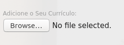

# FSS Demo - Cafeteria

## Uma simples aplicação web que irá fazer o upload de um objeto para um bucket escolhido!

 

## Quickstart:

### Pré-requisitos

* Docker instalado
* Um bucket AWS S3
* Uma [chave de acesso](https://aws.amazon.com/premiumsupport/knowledge-center/create-access-key/) à conta AWS com permissões de escrita ao bucket.

### Configuração

1. Abra o arquivo `docker_run.sh`. 
2. Altere os conteúdos das variáveis de ambiente com os seus valores
* `AWS_ACCESS_KEY_ID` - A ID da sua chave de acesso AWS 
* `AWS_SECRET_ACCESS_KEY` - Sua chave de acesso AWS 
* `BUCKET_NAME` - a URL do seu bucket
* `BUCKET_REGION` - a região AWS do seu bucket (ex. `us-east-1` )

### Rodando

1. Execute `./docker_run.sh`
2. Coloque no seu browser para acessar a página Web `localhost:8000`

### Outras opções de deploy

- [Deploy usando AWS ECS Fargate](docs/ECS_Deploy.md)

---

## Testando:

 

<ul>

<li> <i> <strong> No site da Cafeteria, clique em "Trabalhe conosco". </strong> </i> </li>

 

 </img>

<li> <i> <strong> Preencha o formulário. </strong> </i> </li>

<li> <i> <strong> Escolha um arquivo para ser colocado no bucket, clicando no botão "browse" em "Adicione o Seu Currículo". </strong> </i> </li>

 

 </img>

<li> <b> Dependendo do tamanho do arquivo, pode ser que demore mais ou menos. </b> </li>

</ul>

No caso de erros, consulte o terminal para ver os logs da aplicação.

 

### WARNING:

        - Este projeto é para o propósito de Demostrações! 

 

 

### Próximos Passos:

 

<b> Para saber mais como testar o Cloud One File Storage Security: 
<a href="https://github.com/SecurityForCloudBuilders/SegurancaParaNuvem/tree/main/SegurancaParaCloudESecOps/SeguracaParaFileStorage"> SeguracaParaFileStorage. </a> 

Ou os outros módulos para ajudar na sua jornada de construção de Segurança na Cloud: <a href="https://github.com/SecurityForCloudBuilders/SegurancaParaNuvem"> SegurancaParaNuvem. </a></b>

<i> <strong> Sinta-se livre para também contribuir! </i> </strong>
